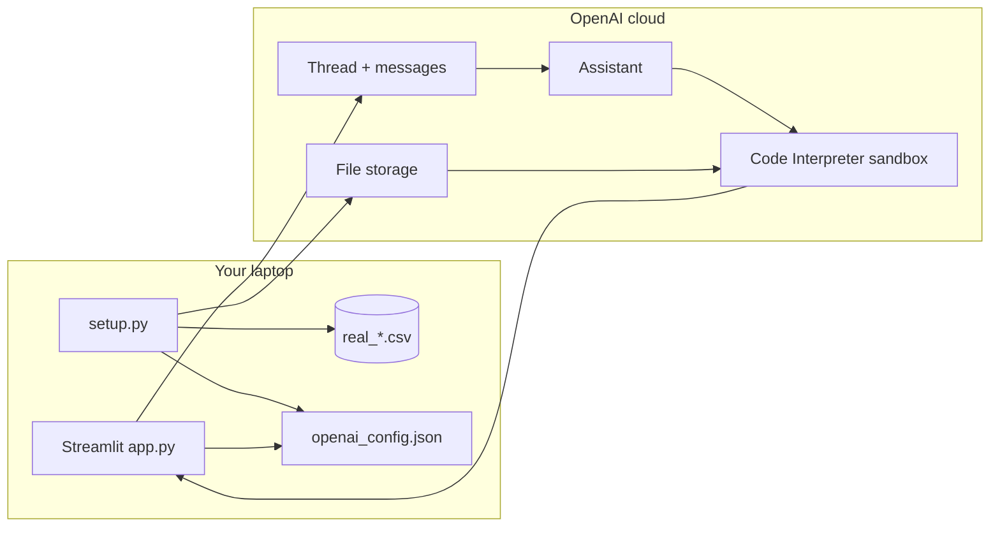
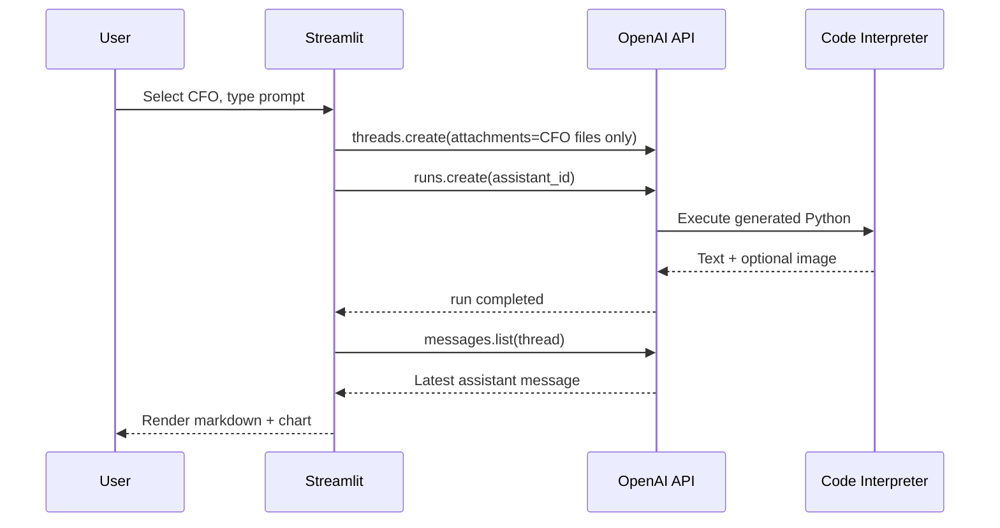

# Architecture

This document explains **how data and requests flow** through the project. Written for beginners and technical interviewers.

---

## Components



| Component | Location | Responsibility |
|-----------|----------|----------------|
| **Streamlit UI** | `app.py` | Chat, role picker, show text/images |
| **Setup pipeline** | `setup.py` | Fetch CSVs, trim rows, upload, save config |
| **Config** | `openai_config.json` | `assistant_id`, `file_ids` |
| **OpenAI Assistant** | Cloud | Instructions, model, tools list |
| **Thread** | Cloud | One conversation turn with attachments |
| **Code Interpreter** | Cloud | Executes Python on attached files |

---

## Two phases: setup vs runtime

### Phase A — Setup (run manually: `python setup.py`)

```
Internet CSV URLs
       ↓
  pandas read + head(400)
       ↓
  real_sales_data.csv
  real_hr_payroll_data.csv
  real_market_data.csv
       ↓
  client.files.create(...)  →  file_xxxxx IDs
       ↓
  client.beta.assistants.create(...)  →  asst_xxxxx
       ↓
  openai_config.json
```

You run this when:

- First time setup
- Data changes
- You need new file IDs after OpenAI file expiry

### Phase B — Runtime (every user question: `streamlit run app.py`)

```
User selects role (CEO | CFO)
       ↓
ROLE_ACCESS[role]  →  list of file_ids
       ↓
New Thread created with:
  - user message (the prompt)
  - attachments: only those file_ids + code_interpreter tool
       ↓
Run assistant on thread
       ↓
Poll until status == completed
       ↓
Read latest assistant message:
  - text blocks → markdown
  - image_file blocks → download & st.image()
```

**Important design choice:** each user message creates a **new thread**. Old threads with long code outputs cause huge token usage and rate limits.

---

## RBAC implementation (the security story)

There is no encryption or row filter in this PoC. Access control is **which files get attached**:

```python
ROLE_ACCESS = {
    "CEO": [sales_id, hr_id, market_id],
    "CFO": [sales_id, market_id],  # no HR id
}
```

When creating a thread:

```python
attachments = [
    {"file_id": fid, "tools": [{"type": "code_interpreter"}]}
    for fid in ROLE_ACCESS[role]
]
```

The CFO’s sandbox literally does not contain the HR CSV. That is stronger than a system prompt saying “don’t look at HR.”

### Production upgrade path

```
User logs in (SSO)
       ↓
Groups: e.g. Finance-Exec, Finance-CFO
       ↓
Map group → allowed dataset connections
       ↓
Attach only those sources to the agent run
```

Same pattern, real identity provider.

---

## What happens inside Code Interpreter?

You do not run Python on your machine. OpenAI:

1. Receives the user question + file handles  
2. Generates Python (typically pandas + matplotlib)  
3. Runs it in an isolated container  
4. Returns stdout, errors, and sometimes image files  

Your `app.py` only **displays** the result.

---

## Assistant lifecycle

| Step | Behavior |
|------|----------|
| First `setup.py` | Creates assistant, saves `assistant_id` in config |
| First `app.py` without config | Creates assistant, appends to config |
| Later runs | Reuses same `assistant_id` via `@st.cache_resource` |

Avoid creating a new assistant on every app restart—wastes clutter in the OpenAI dashboard.

---

## Message content types

The app handles two block types from the API:

| Type | UI action |
|------|-----------|
| `text` | `st.markdown()` |
| `image_file` | Download bytes via `client.files.content()`, `st.image()` |

Charts fail when the model answers with text only. Instructions in `ASSISTANT_INSTRUCTIONS` push matplotlib + `plt.show()`.

---

## Feedback loop

Thumbs up/down append one row to `feedback_log.csv`:

```csv
role,prompt,Good|Bad
```

Useful for a PoC “human review” story; not a production observability pipeline.

---

## Failure handling

| Failure | Handling in `app.py` |
|---------|----------------------|
| Rate limit (429) | Parse “try again in Xs”, sleep, retry up to 5 times |
| Run timeout | 120s max polling, then `TimeoutError` message |
| Run failed | Show `run.last_error.message` |
| Role switch | Clear `messages` and `thread_id` |

---

## Why Assistants API (and caveats)

**Pros for a 24h build:**

- File attach + Python sandbox in one API  
- Little infrastructure  

**Cons:**

- API is **deprecated**—migrate for long-term products  
- Cost and token use are hard to predict  
- Less control than running pandas locally  

See **INTERVIEW_NOTES.md** for when to replace this with low-code + data platform tools.

---

## File dependency graph

```
.env (API key)
  └── setup.py → real_*.csv, openai_config.json
        └── app.py (reads config, uses file IDs)
              └── feedback_log.csv (optional, append-only)
```

---

## Sequence diagram (one question)



This is the entire runtime architecture.
