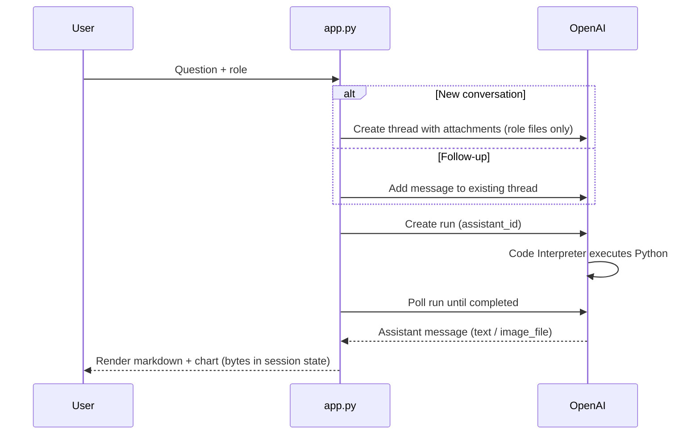

# Architecture

Technical design of **llm-optima**: components, request flow, security, and extension points.

---

## System context

The application is a **thin orchestration layer** around OpenAI’s hosted assistant and code interpreter. Custom code owns:

- User interface and session state
- Role-to-file mapping (RBAC)
- Polling and error handling for runs
- Persisting charts in the UI
- Feedback logging

The LLM, Python runtime, and file storage for analysis are provided by OpenAI.

---

## Components

| Component | File / artifact | Responsibility |
|-----------|-----------------|----------------|
| Web UI | `app.py` | Chat, role selection, render messages and charts |
| Setup | `setup.py` | Fetch CSVs, cap row count, upload files, create assistant |
| Feedback | `feedback.py` | Append structured rows to `feedback_log.csv` |
| Config | `openai_config.json` | `assistant_id`, `file_ids` for sales / hr / market |
| Secrets | `.env` | `OPEN_AI_API` |
| Datasets | `real_*.csv` | Local copies used for upload |

---

## Setup pipeline

```
Public CSV URLs
      │
      ▼
pandas → head(MAX_ROWS_PER_FILE) → real_*.csv
      │
      ▼
OpenAI Files API (purpose: assistants)
      │
      ▼
OpenAI Assistants API (instructions, gpt-4o-mini, code_interpreter)
      │
      ▼
openai_config.json
```

Re-run when data changes or OpenAI file IDs are invalid.

---

## Runtime: single question



### Thread strategy

- **First message** in a session: new thread + file attachments for that role.
- **Follow-ups**: same `thread_id`; files remain available in the sandbox context.
- **New chat** (UI): clears `thread_id` and UI history; next question starts a new thread.

This balances **context** (follow-ups work) with **cost** (unrelated topics should use a new chat).

---

## Security model (PoC)

Access control is implemented by **which files are attached** when the thread is created:

```python
ROLE_ACCESS = {
    "CEO": [sales_id, hr_id, market_id],
    "CFO": [sales_id, market_id],
}
```

Attachments are passed per OpenAI’s thread message format with `code_interpreter` tool access.

**Not included in this PoC:** authentication, row-level security, audit beyond feedback CSV, data residency controls.

**Production direction:** Entra ID (or similar) → group membership → allowed datasets in Fabric/Snowflake with RLS → agent tools that query governed views only.

---

## Assistant message handling

OpenAI returns content blocks:

| Block type | Application behavior |
|------------|------------------------|
| `text` | Rendered as markdown; stored in session `parts` |
| `image_file` | Downloaded via Files API; stored as base64 in session; rendered with `st.image` |

Charts persist across Streamlit reruns because image bytes live in `st.session_state.messages`, not only in the live widget tree.

---

## Feedback path

```
User clicks Good / Bad (+ reason)
        │
        ▼
record_feedback() → feedback.log_feedback()
        │
        ▼
feedback_log.csv (append-only)
```

`feedback.py` defines columns and reason categories. The UI stores `feedback` on the message object so buttons do not reappear after submission.

---

## Failure handling

| Condition | Behavior |
|-----------|----------|
| Rate limit (429) | Parse retry delay, sleep, retry up to 5 times |
| Run timeout | 120s polling cap, user message to simplify or new chat |
| Run failed | Surface `last_error.message` |
| Role change | Clear messages, thread, and turn counter |

---

## API note

The build uses the **Assistants API** (threads, runs, attachments). OpenAI has marked parts of this surface as deprecated. A production rollout should plan migration to the **Responses API** / **Agents SDK** while keeping the same logical split: UI + RBAC + tool execution.

---

## Production extensions

| Area | PoC | Production |
|------|-----|------------|
| Auth | Dropdown role | SSO + group claims |
| Data | CSV upload to OpenAI | Warehouse + semantic layer + RLS |
| Execution | Remote Code Interpreter | SQL/Python tools in your VPC optional |
| Feedback | Local CSV | DB + review dashboard |
| Cost | Manual new chat | Per-team quotas, caching, eval regression tests |
| Charts | Model-generated | Optional server-side render from query results |

---

## Key code references

- RBAC attachments: `create_thread_with_files()` in `app.py`
- Thread reuse: chat handler branch on `st.session_state.thread_id`
- Chart persistence: `render_assistant_message()` → base64 in `parts`
- Feedback: `render_feedback_ui()` / `record_feedback()` in `app.py`
